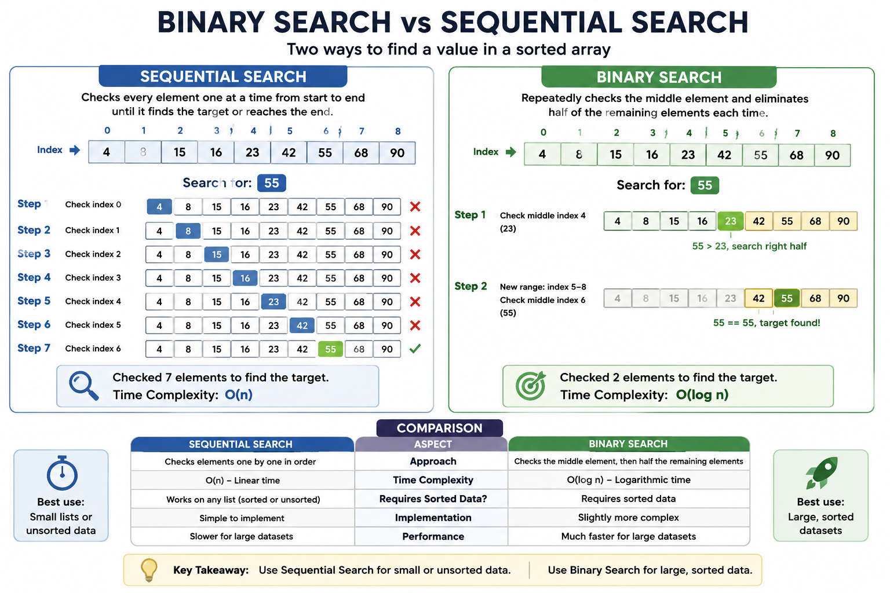

# Code Challenge: Binary Search in a Sorted 1D Array

## 📋 Specifications

Read all of the following instructions carefully.

- Name things **exactly** as described.
- Do all of your work in a public repository called **`data-structures-and-algorithms`**.
- Create a new branch in your repository called **`array-binary-search`**.
- Make a directory for this challenge, named according to your language's conventions, containing a **`README.md`** file.
- Update the **Table of Contents** in the root `README.md` with a link to this challenge's README.

> **Note:** This is a **whiteboard-only** challenge.

Write out code as part of your whiteboard process, but don't worry about creating external program files.

---

# 🎯 Feature Tasks

Write a function called **`BinarySearch`** that accepts two parameters:

1. A **sorted array**
2. The **search key**

Without using any built-in search methods provided by your programming language, return:

- The **index** of the array element that matches the search key.
- **`-1`** if the search key is not found.

> **Important:** Your function **must use the Binary Search algorithm**.

See the **Resources** section for more information.

---

# 📝 Example

| Input | Output |
|--------|--------|
| `[4, 8, 15, 16, 23, 42], 15` | `2` |
| `[-131, -82, 0, 27, 42, 68, 179], 42` | `4` |
| `[11, 22, 33, 44, 55, 66, 77], 90` | `-1` |
| `[1, 2, 3, 5, 6, 7], 4` | `-1` |

---

# 🔍 Binary Search

Binary Search is an efficient algorithm for finding an item in a **sorted array**.

Instead of checking every element one at a time, Binary Search repeatedly:

1. Looks at the middle element.
2. Compares it to the target value.
3. Eliminates half of the remaining array.
4. Repeats until the value is found or no elements remain.

Because it cuts the search space in half each time, Binary Search runs in **O(log n)** time.

---


# 📚 Resources

- Wikipedia: **Binary Search Algorithm**

---

# ⭐ Stretch Goal

Suppose the array contains **objects** instead of primitive values, and the objects are sorted by a particular property.

For example:

```javascript
[
  { name: "Alice", age: 21 },
  { name: "Bob", age: 25 },
  { name: "Charlie", age: 30 }
]
```

What changes would you make to Binary Search to search for a specific property value?

Write pseudocode describing your approach.

---

# 📤 Submission Instructions

- Work within the proper folder structure for your language.
- Create a new `README.md` using the provided README template.
- Embed an image of your completed whiteboard that matches the example layout.
- Optionally complete the code written on your whiteboard along with a proper suite of tests.
- Try giving your algorithm to a chatbot and see if it can generate working code and tests.
- Create a Pull Request from your branch into the `main` branch.

---

# ✅ Pull Request Checklist

Comment on your Pull Request with the following checklist:

```markdown
- [ ] Top-level README "Table of Contents" is updated

- [ ] README for this challenge is complete
  - [ ] Summary
  - [ ] Description
  - [ ] Approach & Efficiency
  - [ ] Solution
  - [ ] Picture of whiteboard
  - [ ] Link to code

- [ ] Feature tasks for this challenge are completed

- [ ] Unit tests written and passing
  - [ ] Happy Path (expected outcome)
  - [ ] Expected failure
  - [ ] Edge Case (if applicable)
```

---

# 🚀 Final Submission

Before submitting:

1. Copy the link to your open Pull Request.
2. Paste the link into the assignment submission field.
3. Leave a comment describing:
   - Approximately how long the assignment took.
   - Any challenges or difficulties you encountered.
   - Any additional notes for your grader.
4. Merge your branch into `main`.
5. Delete your feature branch.

> **Note:** Deleting the branch will **not** remove the Pull Request link.
