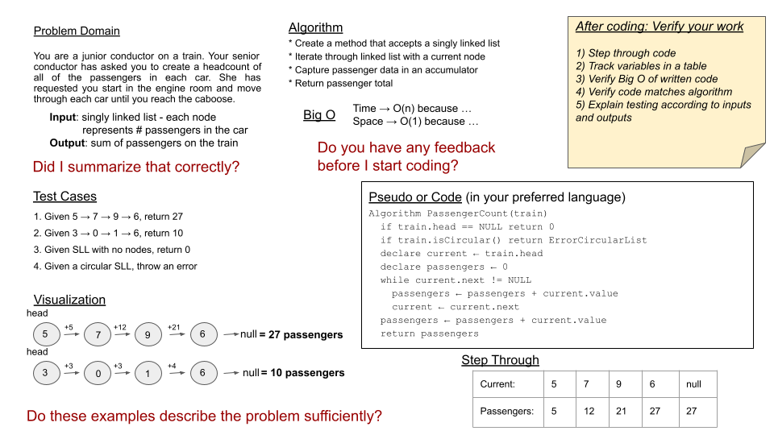

# Mock Interviews

> **Read all of the following instructions carefully.**

---

## 📋 Specifications

Today, you and a peer will take turns interviewing each other with a code challenge.

- The interviewer will score the candidate according to the **Whiteboard Rubric**.
- Notes can be taken in an electronic copy of the document or on a printed copy.
- In either case, the completed rubric will be given to the candidate for review purposes.
- The candidate will submit the completed rubric with the score they achieved as a candidate.
- ⏱️ **Each interview should be time-boxed to a strict 30 minutes.**

---

## ❓ Interview Questions

**Don't look at the interview questions until you decide who will be the first interviewer.**

- The first interviewer will ask **Question 1**.
- The second interviewer will ask **Question 2**.

---

## 🧠 Structure

Utilize your whiteboard skills to solve the problem according to:

- The steps in the **Whiteboard Rubric**
- The **Example Whiteboard Layout**

---

## 📝 Example

By the end of the interview, your whiteboard should resemble the provided **Example Whiteboard Layout**.

---

## 📄 Documentation

The interviewer should:

- Take detailed notes on the **Whiteboard Rubric**.
- Assess points for **every item** on the rubric.
- Sum the total points.
- Record the final score on the form.

---

## 📤 Submission Instructions

1. Review the notes your interviewer recorded for you on the rubric.
2. Submit the final result of your interview as a candidate to this assignment.
3. Paste the link to the rubric that evaluated you as a candidate:
   - Google Doc, **or**
   - Photo of a completed printed rubric.
4. Comment on your submission with a summary of:
   - How the interview went
   - What went well
   - What you'd like to improve